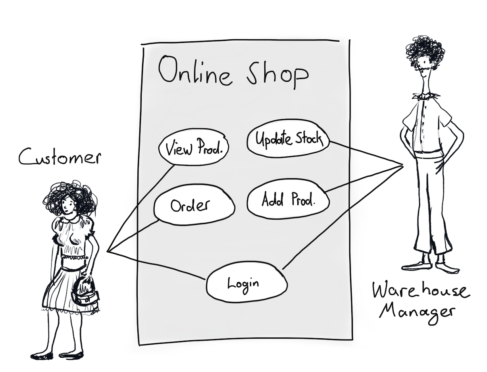
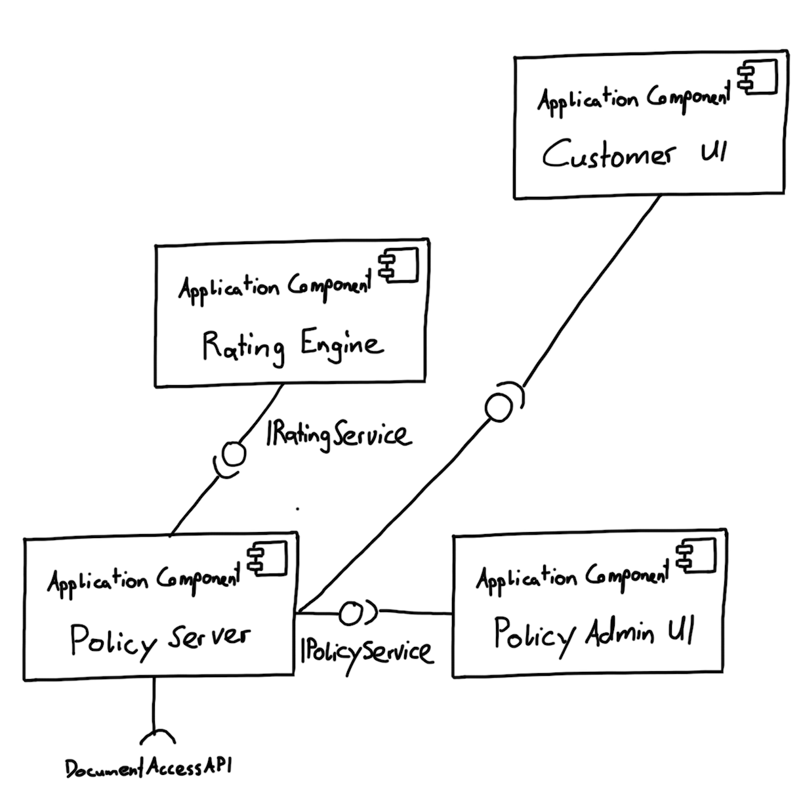
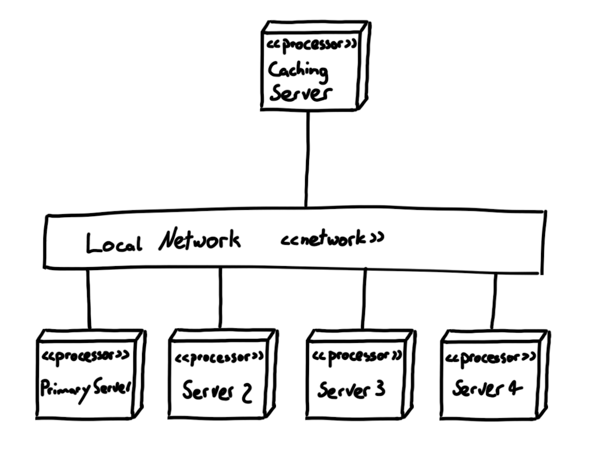

# {{page.title}}

This article is about why you should sketch more in your daily work and why you should use the power of shapes and colours in your documentation.
With the help of illustrations, you can transfer knowledge in a way that is faster, easier to remember and you can prevent misunderstandings.
For instance, if you want to describe the shape of Switzerland in words, you will probably need hundreds of words. The same information in form of an illustration can be processed by our brain in less than a second and it would still be more precise than the description.

## Our brain handles pictures very well
The ability to see and recognize patterns and movement is millions of years old and has improved over time during evolution. The life of our ancestors hugely depended on it. Writing is a human constructed concept to persist spoken words and it is only a few thousand years old. That means our brain handles picture much faster than text. In addition, it is also more fun to watch and study pictures than to read text. As an example, let's take an IKEA manual of how to build a closet. The illustration based manual is more effective than a text based description could ever be.

| Easier to understand                | Easier to map to the real world         | Easier to prevent errors                |
|-------------------------------------|-----------------------------------------|-----------------------------------------|
||    |     |
| Less effort to study the pictures than to read a description. Therefore, it's much more likely that people will grasp the picture manual. | Easier to map the manual to the real world. E.g. which screw has to be used.| Easier to prevent errors. E.g. the picture clarifies which screw to use. It's less likely that someone uses the wrong screw.  |

## Illustrations in software development
The architecture of software is not that different to the architecture of a closet or another piece of furniture. Both consist of a lot of smaller parts where each small part has to fulfil its purpose. That's why if you use illustrations in your software documentation, each of the advantages of the table in the previous chapter will apply as well.
The difference between a software architecture and a piece of furniture is that the software architecture is more complex. It has more layers and different life cycle states. Depending on what you want to describe, you will need a different kind of illustration. The following table shows some of the most common diagrams used in software development documentations.

| Use case model                         | Activity diagram                        | Sequence diagram                        |
| -------------------------------------- | --------------------------------------- | --------------------------------------- |
|  |  |  |

| Class diagram                          | Component diagram                       | Deployment diagram                      |
| -------------------------------------- | --------------------------------------- | --------------------------------------- |
|      |      ||  

## Sketch to understand
If you work on a software development project, you will probably face complex problems on a daily basis. 
Some common ones are: Concurrency issues, async dataflow, evolutionary architecture, communication to other applications or how do to implement a specific part of the business logic.
Sketches can help you to understand and solve many of those issues. Let's make an example. You're a software engineer and have to implement a part of a business logic. A service that creates an overview of all your bank accounts and their credit.
The requirement for the transformation will probably be a list of rules. Including how to handle different currencies and its exchange rate.
To draw a workflow diagram and having it on a paper in front of you, will help you to understand the data flow and the connection between the rules. It will help you to simplify your workflow diagram. Maybe some conditions are already included in other ones and can be pruned away. Or you can simplify the workflow by changing the order in which the rules are applied.

## Conclusion
Visualizing your work can save you time, energy and sharpen your thoughts. All you need to do is to grab a pen and paper.
Try to sketch more often during your daily work. And next time you have to explain your system architecture to a new team member, sketch it.

*By {{page.authorName}}*
